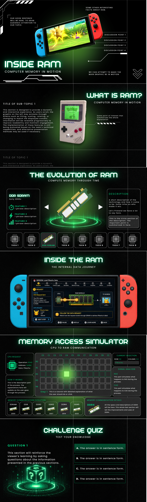

# Case Study Project 2 Proposal
## CSARCH2 - S04
### Group 6

### Members
- Caindoy, Thistle
- Infante, Gabriel
- Martinez, Gabrielle
- Melanio, Marion
- Omandac, Karl

### Topic Theme
- Topic: How RAM Works

### Topic Title
- Title: Inside RAM - Computer Memory in Motion

### Website Deployment Link
https://dev-gabb-711.github.io/arch2-case-study-2/

### Section 1: What is RAM?
**Overview Implementation**: This introductory section aims to establish the foundational concepts necessary for understanding the inner workings of RAM. Visitors will be introduced to the purpose of computer memory, the role RAM plays in system performance, and how it interacts with the CPU during normal computer operations. Through visual aids, examples, and simplified diagrams, this section will provide the background knowledge needed to understand the more technical concepts presented in later sections.

**Outline**:
- Hook
  - This exhibit will explore the architectural principles of volatile memory by analyzing how a game save file is maintained within the volatile SRAM component of a retro game circuit, specifically using a Generation 1 Pokémon game as a case study. Instead of introducing RAM through dry, textbook definitions, the exhibit hooks the audience with a familiar scenario: how a player's digital progress (in-game coordinates, team data, and inventory) is actively held in a specialized type of RAM, and the technical breakdown of why that memory completely vanishes when its power source is compromised. While the discussion acknowledges that this volatile memory operates alongside the main Read-Only Memory (ROM) architecture of the overall cartridge package, the primary focus of this exhibit remains strictly on how RAM works—delving into its internal operations, data retention requirements, and memory architecture.
- What is ram?
  - This subsection provides a general explanation of Random Access Memory (RAM) and its role as the computer's primary working memory. The discussion will focus on RAM as a temporary storage location for data and instructions that are actively being used by the CPU.
  - Key concepts we can include:
    - RAM as a high-speed working area for currently active programs and data.
    - The meaning of "random access" and how any memory location can be accessed directly.
    - Volatility and why RAM contents disappear when power is removed.
    - The relationship between RAM capacity and the number of applications that can be actively used at the same time.
  - Simple real-world analogies may be used to help visitors understand why RAM functions as a temporary workspace rather than a permanent storage location.
- Memory
  - This subsection broadens the discussion to computer memory as a whole. Visitors will learn how information is represented, stored, and accessed within a computer system.
  - A general explanation of what Memory is, its use, and how it communicates with the CPU, which transitions to Von Neumann Architecture
  - Topics we can include:
    - What memory is and why computers require it.
    - How data and instructions are stored as binary values.
    - The concept of memory addresses and how the CPU locates information.
    - Simple memory maps inspired by LBYARCH activities showing how variables are assigned memory locations.
    - Examples demonstrating how a variable's value can be retrieved by referencing its address.
  - The goal is to bridge the gap between programming concepts and physical computer hardware while preparing visitors for the discussion of memory access in later sections.
- Von Neumann Architecture
  - A brief version of Section 2, where mainly the interaction of the Memory and the CPU through busses is discussed.
  - This subsection introduces the role of memory within the broader computer architecture. Rather than providing a complete architectural deep dive, the focus will be on how the CPU communicates with memory.
  - We can include these diagrams:
    - CPU as the processor of instructions.
    - Memory as the storage location for programs and data.
    - Address buses used to specify memory locations.
    - Data buses used to transfer information.
    - Control signals used to coordinate memory operations.
- RAM vs ROM
  - A brief comparison of the usage, data handling, and memory size of RAM and ROM.
  - We can include:
    - Purpose and function of RAM and ROM.
    - Volatile versus non-volatile storage.
    - Typical capacities and applications.
    - Examples of data commonly stored in each memory type.
    - Why both forms of memory are required for a functioning computer system.
  - A comparison table or visual diagram may be included to help visitors quickly identify the strengths and limitations of each memory technology.

### REVISIONS - Section 2: The Evolution of RAM
**Info**: This section explores the historical development and progression of RAM technologies.

**Implementation**: This section will feature an interactive timeline showcasing major RAM generations and their evolution over time. The image displayed changes while scrolling down according to which timeline is being discussed.

**Outline**:
- Analytical Engine
- Drum Memory
- Magnetic Core Memory
- Matrix Core Memory
- Dynamic Random Access Memory
- MOS Dynamic RAM and EPROM
- EDO DRAM
- SDRAM
- DRDRAM AND PSRAM
- DDR SDRAM
- DDR2 SDRAM
- DDR3 SDRAM

### Section 3: Inside the RAM - The Internal Data Journey
**Info**: A deep-dive simulation tracking a data stream through a detailed physical diagram of a RAM module. It explains how internal hardware components interact to process requests, combining the step-by-step application flow with immediate hardware definitions and function explanations.

**Implementation**: This section features a high-fidelity, interactive circuit diagram of a RAM stick. Upon loading, an animated data stream (representing an app request) enters the module. The camera dynamically pans and zooms, following the stream as it physically travels through every internal component. As the data "visits" each component, that part highlights, and a modal displays its definition, technical function, and role in the current operation (Reading or Writing). Once the journey is complete, the diagram enters a free-roam state where users can re-click components, and a prominent button appears linking to the next section.

- Unified Narrative: The "App Opening" process is told through the journey of data physically moving within the RAM's architecture.
- The Guided Tour (Data Stream Path):
  - Entry Point (Connection Pins/Gold Contacts): The data stream enters. Pop-up defines the interface between the motherboard and the RAM module.
  - The Brain (SPD Chip & Register/Buffer): The stream hits these first. Explains how the SPD tells the system how to talk to the RAM, and how Control Logic manages the incoming commands.
  - The Routing (Row & Column Decoders): The stream splits into address signals. Pop-up explains how these components translate abstract memory addresses into physical coordinates on the matrix.
  - The Destination (The Memory Array - Banks, Rows, Columns): The stream arrives at the core grid. Explains the hierarchy of how data is stored in massive arrays.
  - The Storage Cell (Transistor & Capacitor): Final zoom-in to the microscopic level. Explains the fundamental dynamic RAM cell, volatility, and the need for electrical refresh cycles.
  - The Retrieval (Sense Amplifiers): (If simulating a "Read" operation) Shows data leaving the cell, being amplified from a tiny charge to a readable 1 or 0.
- After this section, the user is allowed to freely click on the components in the full view of the RAM diagram and details about each component will be shown as well.
- The flow of data will also be continuous throughout the RAM diagram

### REVISIONS - Section 4: Memory Access and Communication
**Info**: In this section, the user will explore how the individual components of RAM cooperate to find and access data. The user will learn how the CPU communicates with RAM through the use of memory addresses, how RAM uses row and column selection to identify a specific place to store data, and how RAS (Row Address Strobe) and CAS (Column Address Strobe) signals work together to perform the retrieval process. You will also get an overview of the evolution of the communication protocols from SDRAM to today's DDR memory types.

**Implementation**: Users interact with a simplified memory map consisting of rows and columns representing RAM storage locations. Given a sample memory request from the CPU, they follow the process of locating the requested data by activating the appropriate row and column signals. As users progress, visual animations highlight the selected row, column, and target memory cell while explanatory tooltips describe the role of each step. Once the correct cell is identified, the stored data is retrieved and sent back to the CPU, completing the memory access process. To connect the concept to real-world hardware, users may explore a comparison panel showcasing the physical interfaces of SDRAM, DDR, DDR2, DDR3, DDR4, and DDR5. Selecting a generation reveals its pin layout, transfer improvements, and communication characteristics.

**Outline**:
- Receiving the Request
  - How the CPU requests data
  - Memory addresses
  - Read and write operations
- Navigating the Memory Map
  - Organization of rows and columns
  - Why RAM uses a grid structure
  - Locating a storage location
- Activating RAS and CAS
  - Row Address Strobe (RAS)
  - Column Address Strobe (CAS)
  - Selecting the target memory cell
- Retrieving the Data
  - Accessing the selected cell
  - Returning data to the CPU
  - Completing the memory request
- Evolution of Memory Communication
  - SDRAM interface
  - DDR memory generations
  - Pin layouts and communication improvements
  - Speed and efficiency advancements
- Interactive Features:
  - Memory Address Explorer
  - RAS/CAS Signal Demonstration
  - Interactive Memory Grid
  - CPU-to-RAM Request Animation
  - DDR Generation Comparison Viewer

### Section 5: Challenge Quiz
**Implementation**: This section will reinforce the viewer's learning by asking questions about the information presented in the previous sections. The question may be one of these types: Multiple Choice, Fill in the Blank and True or False. The question and answer will be stored in the server side to avoid bloating the client side and to avoid getting the answers via inspect element.

### Tentative Style Guide Snapshot

## Incremental README

- **July 2**
  - Created the `.mdx` page together with the Astro component and CSS file for the **Inside RAM - Computer Memory in Motion** exhibit.
  - Started the basic layout for the Title Page and Section 1.
  - Matched the page ratio and overall structure to the approved style guide.

- **July 3**
  - Finalized the layout of the Title Page and Section 1 to closely match the style guide.
  - Adjusted the sizing, spacing, positioning, and responsiveness of all the added UI elements.
  - Added info for Title and Section 1, Preparation for Layouting Section 2.

- **July 4**
  - Started basic structure of the Memory Access Communication Segment of the Component.

- **July 5**
  - Finished half of the CCS for the Memory Access Communication Segment having trouble fitting the grid into the page, Overhauled Section 2 layout to have two individual parts instead.

- **July 6**
  - Refined the layout of the Memory Access Communication segment (Section 4).
  - Fixed the panel sizing, spacing, alignment, and positioning to better match the approved style guide.
  - Updated the typography and background styling for consistency with the rest of the exhibit.
  - Finished most of the layout required for the Challenge Quiz, will add the content after Mid-Milestone.
  - Finished the entirety of the layout and information needed for Memory Access Communication segment (Section 4)
  - Started on the layout of the Inside the RAM segment (Section 3).
  - Improved Section 3 layout and design.

- **July 7**
  - Finished the entirety of Section 3.
  - Finished the timeline on the RAM Evolution segment of Section 2.
  - Added additional required info in the What is RAM segment of Section 1.
  - Finished formatting and added references and AI disclosure

- **TO BE DONE FOR THE FINAL SUBMISSION**
  - Fully Implement the interactive elements of Section 3 (Internal Data Flow of Memory and Information), Section 4 (Memory Access and Communication Grid Selection and Display), and Section 5 (Challenge Quiz)
  - Improve UI that fits properly with the theme of the virtual exhibit

- **TO BE DONE (REVISIONS)**
  - document your development (things done) in the readme (aha moments, things learned, challenges, creative development, etc) as well as things to be done on the final submission.  Those documents should be part of the incremental readme (new document on top of the previous proposal document). **Note**: Put this at the top of the README
  - DDR4/5 discussion missing
  - Comparison chart among memory will be helpful
  - Keep improving the web contents and interactive elements of your web apps.

- **July 13**
  - Added information re: DDR4 and DDR5 for Section 2's RAM Evolution
  - Fixed bottom tab moving by setting it at the bottom of the page by setting the top margin to auto

- **July 16**
  - Edited the filenames of all group-made files (components, styles, assets, etc.)
  - Fixed the layout of the bottom part of Section 4 (Memory Access Communication)

- **July 19**
  - Fixed the format and layout of Memory Access Communication segment so that it fits better
  - Had an "Aha!" moment where I realized that our old format for section 4 simply does not work because of the size of the virtual exhibit format. Therefore it was changed to a more lenient style

## Reference Citations

- Patterson, D. A., & Hennessy, J. L. (2021). Computer organization and design RISC-V edition: The hardware/software interface (2nd ed.). Morgan Kaufmann.
- Stallings, W. (2022). Computer organization and architecture: Designing for performance (11th ed.). Pearson.
- Tanenbaum, A. S., & Austin, T. (2016). Structured computer organization (6th ed.). Pearson.
- Dennard, R. H. (1968). Field-effect transistor memory. IBM Journal of Research and Development, 12(5), 321–326. 
- JEDEC Solid State Technology Association. (n.d.). DDR SDRAM standards. https://www.jedec.org/standards-documents
- Micron Technology. (n.d.). DRAM technology. https://www.micron.com/
- Intel. (n.d.). What is RAM? https://www.intel.com/content/www/us/en/gaming/resources/what-is-ram.html
- IBM. (n.d.). Computer memory. https://www.ibm.com/think/topics/computer-memory
- Rambus Inc. (n.d.). History of Rambus Memory Technology. https://www.rambus.com/
- Computer History Museum. (n.d.). Timeline of computer history. https://www.computerhistory.org/timeline/
- Computer History Museum. (n.d.). Babbage's Analytical Engine. https://www.computerhistory.org/babbage/
- Encyclopaedia Britannica. (n.d.). Analytical Engine. https://www.britannica.com/technology/Analytical-Engine
- Kingsun PCB. (n.d.). What is a RAM PCB? Basics and functions explained. https://www.kingsunpcb.com/what-is-a-ram-pcb-basics-and-functions-explained/
- MicrochipUSA. (n.d.). Memory chips 101: Everything you need to know. https://www.microchipusa.com/electrical-components/memory-chips-101-everything-you-need-to-know
- RS Components. (n.d.). Different types of memory chips explained: RAM, ROM, and more. https://hken.rs-online.com/web/content/discovery/ideas-and-advice/different-types-of-memory-chips-explained-ram-rom-and-more
- Micro Center. (2019, December 1). Anatomy of RAM for desktop computers. https://www.microcenter.com/tech_center/article/11167/anatomy-of-ram-for-desktop-computers
- Toolhouse. (2023, April 17). What is the SPD-EEPROM information. https://www.toolhouse.de/en/support/knowledgebase/what-are-spd-eeprom-informations/
- Open IP Hub. (2025, January 10). SPD reader for UberDDR3 – Post #11. https://www.openiphub.com/post/spd-reader-for-uberddr3-post-11
- JLCPCB. (n.d.). What is a power management IC (PMIC): Functions and applications. https://jlcpcb.com/blog/what-is-a-power-management-ic
- Logical Increments. (2019, September 8). RAM channels guide: The what, and the how. https://blog.logicalincrements.com/ram-channels-explanation-guide/
- Crucial. (2026, January 27). What is a memory rank. https://eu.crucial.com/support/articles-faq-memory/what-is-a-memory-rank

## Disclosure on the use of AI/LLM

The group declares that this assignment is entirely of our own work and thought. No AI tools or LLMs were used in its making.